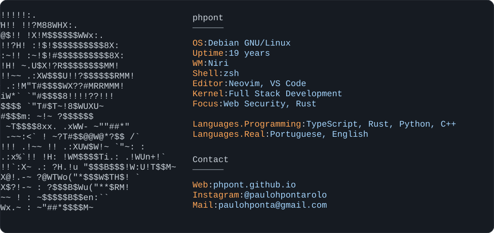

<picture>
  <source media="(prefers-color-scheme: dark)" srcset="https://phpont.github.io/phpont/profile-dark.svg?v=2c723307605a">
  <source media="(prefers-color-scheme: light)" srcset="https://phpont.github.io/phpont/profile-light.svg?v=6900f1536840">
  
</picture>
